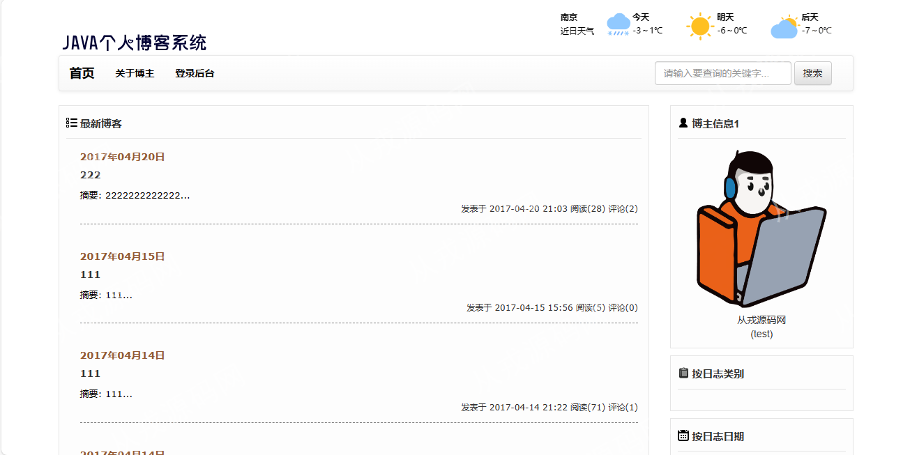
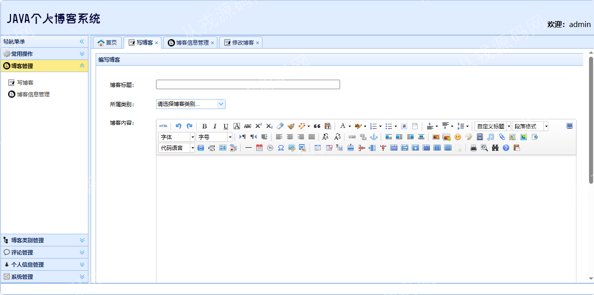
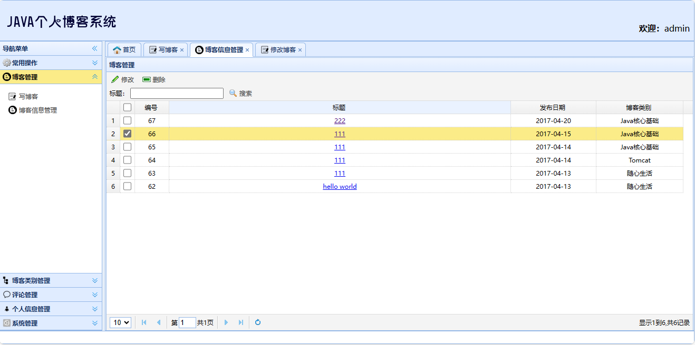
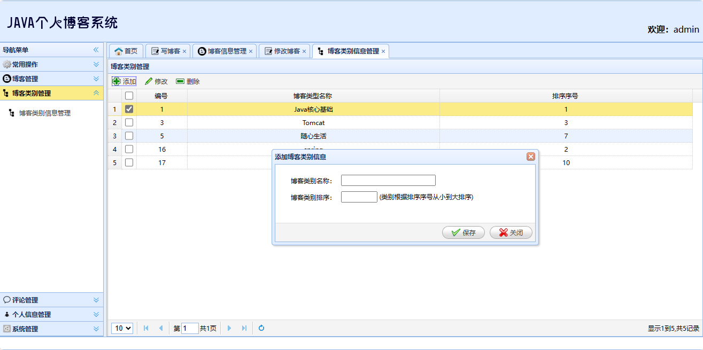
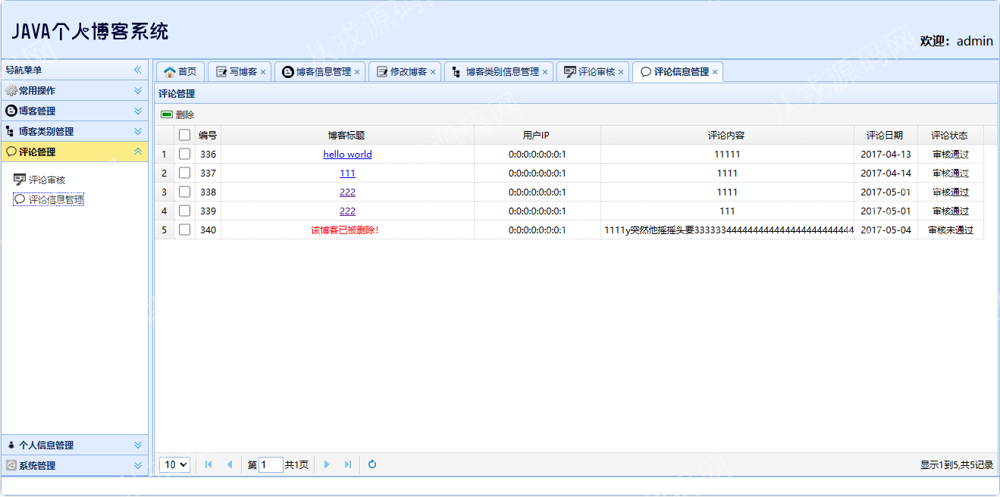

<h1 align="center">57.个人博客管理系统</h1>

- <b>完整代码获取地址：从戎源码网 ([https://armycodes.com/](https://armycodes.com/))</b>
- <b>技术探讨、资料分享，请加QQ群：692619798</b> 
- <b>作者微信：19941326836  QQ：952045282</b> 
- <b>承接计算机毕业设计、Java毕业设计、Python毕业设计、深度学习、机器学习</b>
- <b>选题+开题报告+任务书+程序定制+安装调试+论文+答辩ppt 一条龙服务</b>
- <b>所有选题地址 ([https://github.com/YuLin-Coder/AllProjectCatalog](https://github.com/YuLin-Coder/AllProjectCatalog)) </b>

## 项目介绍
基于ssm的个人博客管理系统：前端jsp、jquery、easyui，后端 spring、mybatis、maven，集成个人博客浏览、详情查看、博客发布、富文本编辑、评论等功能于一体的系统。

## 功能介绍

### 用户

- 首页：博客列表、博客详情、关键词搜索、博主信息查看、本地天气预报查看、分页功能
- 关于博主：查看博主信息、按日志类别、按日志日期等

### 管理员

- 博客管理：博客的增删改查、博客内容支持富文本编辑
- 博客类别管理：博客类别的增删改查
- 评论信息管理：评论的增删改查、评论审核通过、评论审核未通过
- 个人信息：个人信息查看、个人信息修改、个人简介支持富文本编辑
- 系统管理：友情链接管理、修改密码、刷新系统缓存、安全退出

## 环境

- <b>IntelliJ IDEA 2021.3</b>

- <b>Mysql 5.7.26</b>

- <b>Tomcat 7.0.73</b>

- <b>JDK 1.8</b>

## 运行截图

